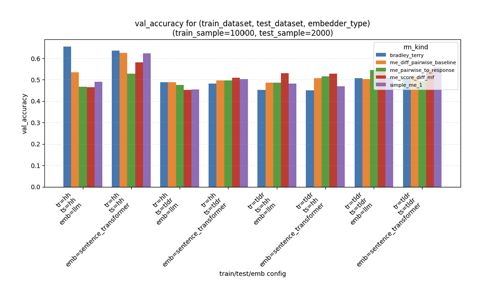

# reward-model-matrix-estimation

*Reward modeling via matrix estimation: impute the preference matrix instead of training a single scalar head.*

Code to accompany the MEng thesis proposal *"Reward Modeling via Matrix
Estimation and Latent-Factor Methods"* (`paper/`): reward models for RLHF
that impute a user x (prompt, response) preference matrix instead of
training a single scalar Bradley-Terry head.

## Models

All five implement the same interface (`rme.types.RewardModel`): `fit(comparisons, embedder)`,
then `score(prompt, response, user)` and `predict_proba(prompt, r1, r2, user)`.

| Key | Class | Idea |
|---|---|---|
| `bradley_terry` | `BradleyTerryModel` | The standard baseline: `score = w . embed(prompt, response)`, fit with the BT logistic loss. |
| `simple_me` | `SimpleMEModel` | Algorithm 1. Empirical win-rate matrix, fully imputed via content-augmented matrix factorization. |
| `me_pairwise_to_response` | `PairwiseToResponseModel` | Algorithm 2. Impute a pairwise-preference matrix first, then fold it into per-response scores via odds-ratio propagation. |
| `me_score_diff_mf` | `ScoreDiffMFModel` | Algorithm 3. Personalized matrix factorization trained directly on the BT log-odds of the score difference. |
| `me_diff_pairwise_baseline` | `DiffPairwiseBaselineModel` | Algorithm 4. Linear scorer over response-pair difference vectors, evaluated against a sampled baseline replay buffer. |

`rme/matrix_completion.py` implements the "SVD++ with item embeddings" step
used by Algorithms 1 and 2: a latent-factor model where each item's factor
is `W @ embedding + free_residual`, so it can score (prompt, response) pairs
it never trained on (`scikit-surprise`'s literal `SVDpp` has no notion of
item content and doesn't generalize this way; it's also a fragile
C-extension install, especially on Windows).

## Results



Pairwise validation accuracy for `bradley_terry` vs. the matrix-estimation
variants, swept over `(train_dataset, test_dataset, embedder_type)` with
`train_sample=10000, test_sample=2000` (`hh` = `anthropic_hh_golden`, `tldr`
= `summarize_from_feedback`). `bradley_terry` leads in-domain (`tr=hh,
ts=hh`), but the matrix-estimation models catch up or edge ahead once
train/test datasets diverge (`tr=hh, ts=tldr` and `tr=tldr, ts=hh`) or on
`tldr -> tldr`, where most models cluster in the 0.45-0.55 range.

## Layout

```
src/rme/
  types.py               Comparison, Embedder, RewardModel
  embeddings.py           HashingEmbedder (offline), SentenceTransformerEmbedder, OpenAIEmbedder
  linear.py               soft-label logistic regression (shared by BT + Algorithm 4)
  matrix_completion.py    content-augmented latent-factor imputer (Algorithms 1 + 2)
  utils.py                item/triplet key helpers
  models/                 the five RewardModel implementations
  data/
    datasets.py           loaders for the 5 named datasets -> list[Comparison]
    splits.py             prompt-disjoint train/test split, OOD splits
    hh_format.py           Anthropic-HH transcript parsing
  evaluation/
    metrics.py             pairwise accuracy + bootstrap CI
scripts/
  inspect_dataset.py       print a HF dataset's actual schema
  run_experiments.py       reproduce the (train, test, embedder) x model grid
notebooks/
  run_experiments.ipynb    thin wrapper around the script above
tests/                     offline, no network/model downloads required
paper/                     the thesis proposal
```

## Install

```bash
pip install -e ".[dev]"          # core + tests, no embedding models or dataset downloads
pip install -e ".[all]"          # + sentence-transformers, openai, datasets
```

## Testing

```bash
pytest
```

Everything under `tests/` runs against `HashingEmbedder` (a deterministic,
dependency-free bag-of-hashed-tokens encoder) and monkeypatched dataset
rows, so the suite needs no network access, model downloads, or API keys.

## Datasets

Loaded via `rme.data.LOADERS`, keyed by name:

- `anthropic_hh_golden` -- `Unified-Language-Model-Alignment/Anthropic_HH_Golden`
- `helpsteer2` -- `nvidia/HelpSteer2`
- `summarize_from_feedback` -- `openai/summarize_from_feedback` (`comparisons` config)
- `collective_alignment_1` -- `openai/collective-alignment-1`
- `prism_alignment` -- `HannahRoseKirk/prism-alignment`

## References

See `paper/` for the full proposal and bibliography (Bradley & Terry 1952;
Koren, Bell & Volinsky 2009; Rafailov et al. 2023; and others).

## License

MIT -- see `LICENSE`.